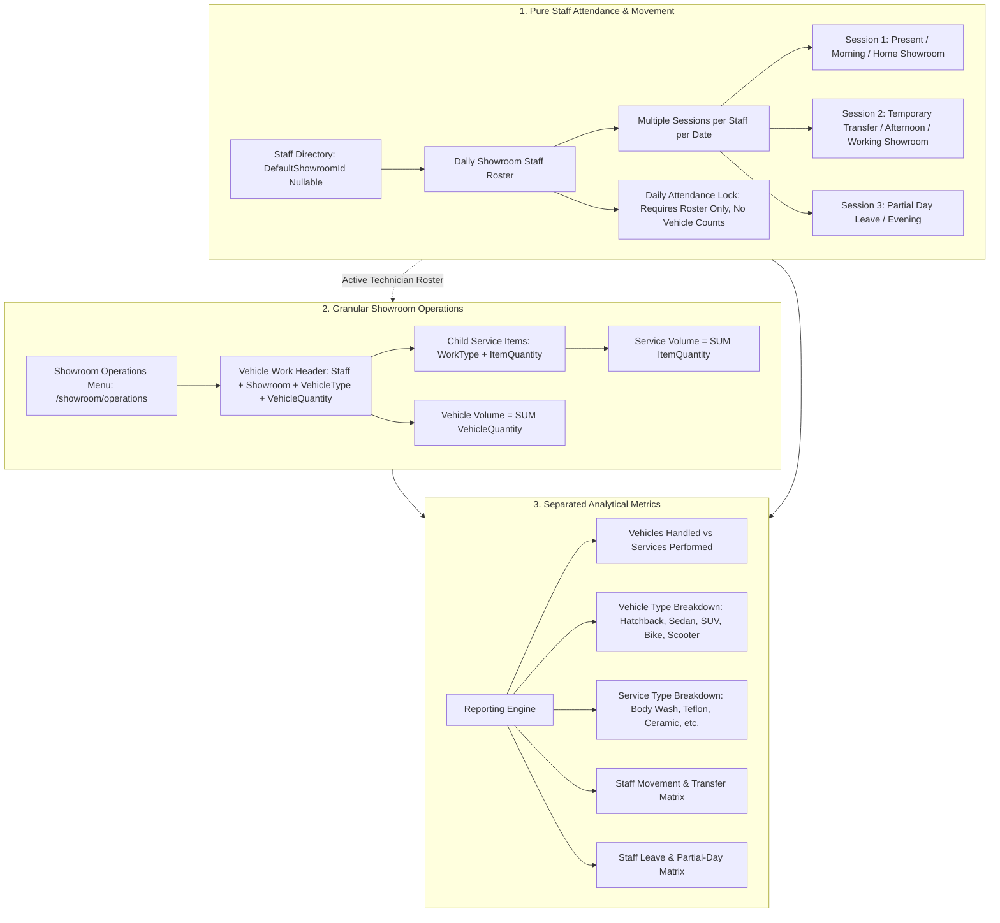
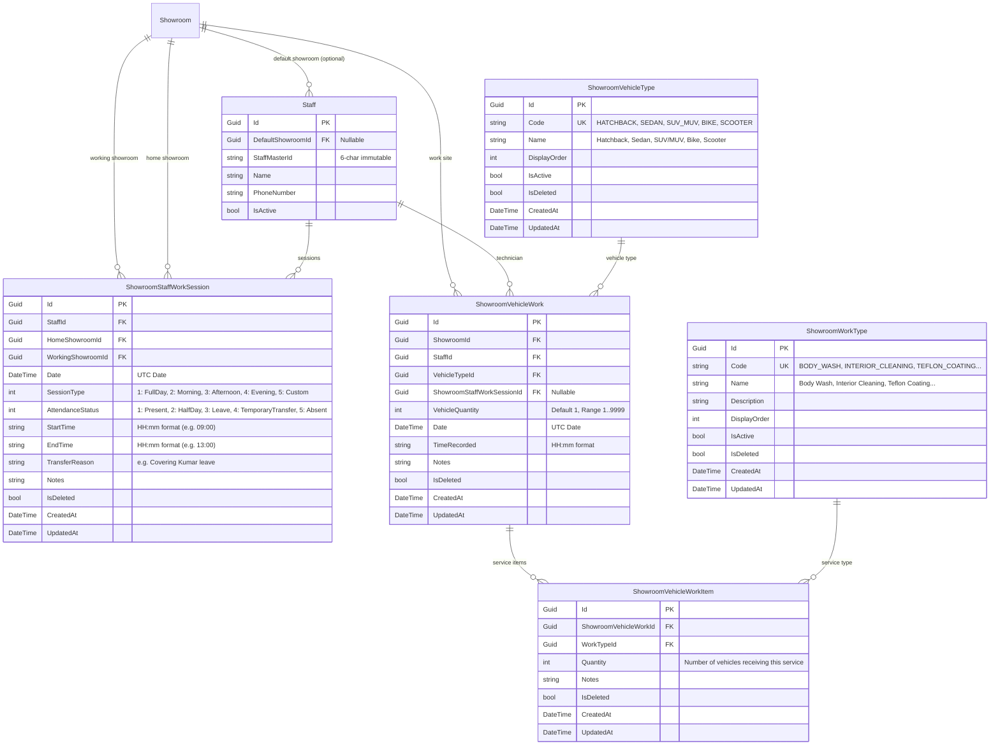

# E6 Showroom Operations & Decoupled Attendance Specification
## Final Architecture Correction & Implementation Specification

---

## 1. Executive Summary of Architecture Corrections

This corrected specification establishes the exact blueprint for separating staff attendance from vehicle and service operations in the E6 Showroom module:



---

## 2. Key Architecture Decisions

### Decision A: Explicit `VehicleQuantity` on `ShowroomVehicleWork`
- `ShowroomVehicleWork` contains an explicit `VehicleQuantity` (int, default 1, range 1..9999).
- `TotalServicesCount` is **never** used as a proxy for vehicle volume.
- *Example 1*: `VehicleType = SUV/MUV`, `VehicleQuantity = 1`, Services = `[Body Wash (1), Ceramic Coating (1)]` $\rightarrow$ **1 vehicle, 2 service operations**.
- *Example 2*: `VehicleType = Hatchback`, `VehicleQuantity = 3`, Services = `[Body Wash (3)]` $\rightarrow$ **3 vehicles, 3 service operations**.

### Decision B: Definition of `ShowroomVehicleWorkItem.Quantity`
- Represents the exact number of vehicles in that work record receiving that specific service.
- *Example*: In a batch of 3 Hatchbacks, if all 3 received Body Wash, `WorkItem(Body Wash).Quantity = 3`.

### Decision C: Strict Separation of Vehicle and Service Metrics
- **Vehicle Productivity**: $\sum \text{ShowroomVehicleWork.VehicleQuantity}$
- **Service Productivity**: $\sum \text{ShowroomVehicleWorkItem.Quantity}$
- Vehicle count is **never** calculated from service count.

### Decision D: Multi-Session Staff Movement Model
- Staff members can have **multiple work sessions on the same date**.
- Permanent `DefaultShowroomId` on the [`Staff`](file:///e:/TTS/Projects/Desktop_Apps/E6_Car_spa_new/backend/api/CarSpaManagement.Api/Domain/Entities/Staff.cs) entity is **never overwritten** by temporary transfers.
- Each [`ShowroomStaffWorkSession`](file:///e:/TTS/Projects/Desktop_Apps/E6_Car_spa_new/backend/api/CarSpaManagement.Api/Domain/Entities) explicitly stores `HomeShowroomId` (origin) and `WorkingShowroomId` (actual operational site).
- *Example*:
  - **Kumar** on `25-Sep-2026`:
    - Session 1: Showroom A (Home: A, Working: A), 09:00–13:00, Status: `Present`.
    - Session 2: Showroom A (Home: A, Working: A), 13:00–18:00, Status: `Leave`, Notes: "Personal leave".
  - **Ravi** on `25-Sep-2026`:
    - Session 1: Showroom B (Home: B, Working: B), 09:00–12:30, Status: `Present`.
    - Session 2: Showroom A (Home: B, Working: A), 13:00–18:00, Status: `TemporaryTransfer`, Reason: "Covering Kumar's afternoon leave".

### Decision E: Service Catalog Inspection & Dedicated Showroom Work Types
- **Inspection Finding**: The existing [`Service`](file:///e:/TTS/Projects/Desktop_Apps/E6_Car_spa_new/backend/api/CarSpaManagement.Api/Domain/Entities/Service.cs) entity represents retail customer services with retail prices, GST tax rates, customer duration, and direct billing links to [`JobCardService`](file:///e:/TTS/Projects/Desktop_Apps/E6_Car_spa_new/backend/api/CarSpaManagement.Api/Domain/Entities/JobCardService.cs) and [`InvoiceItem`](file:///e:/TTS/Projects/Desktop_Apps/E6_Car_spa_new/backend/api/CarSpaManagement.Api/Domain/Entities/InvoiceItem.cs).
- **Domain Separation**: Showroom operational tracking is B2B technician task logging across dealerships (billed on daily lump-sums via `ShowroomDailyBill`). Showroom tasks include dealership-specific operations (Pre-Delivery Inspection Wash, Inventory Dusting, Stockyard Transit Wash) that are not retail catalogue items.
- **Architectural Decision**: Implement dedicated [`ShowroomWorkType`](file:///e:/TTS/Projects/Desktop_Apps/E6_Car_spa_new/backend/api/CarSpaManagement.Api/Domain/Entities) master data seeded with `Body Wash`, `Interior Cleaning`, `Teflon Coating`, `Ceramic Coating`, `Waxing`, `Polishing`, and `Other`. This prevents retail pricing changes from destabilizing dealership operational logging.

### Decision F: Nullable `DefaultShowroomId` on Staff
- [`Staff.cs`](file:///e:/TTS/Projects/Desktop_Apps/E6_Car_spa_new/backend/api/CarSpaManagement.Api/Domain/Entities/Staff.cs) adds `public Guid? DefaultShowroomId { get; set; }` as **nullable**.
- Existing staff in the database remain `null` (representing roving/general technicians).
- No arbitrary showroom assignments are forced during migration.
- Managers can assign a default showroom when editing staff profiles or creating new staff.

### Decision G: Legacy Backward Compatibility
- Existing `ShowroomStaffAssignment.VehiclesAttended` column is retained in the database schema.
- For new records, legacy endpoints compute vehicle totals via $\sum \text{ShowroomVehicleWork.VehicleQuantity}$.
- Historical records containing only `VehiclesAttended` continue to return their recorded values.

### Decision H: Attendance Confirmation Decoupling
- `ConfirmAttendanceAsync` validates only the staff roster (requires $\ge 1$ assigned staff member).
- Vehicle counts are **not** required for attendance confirmation.
- Vehicle work can be logged continuously throughout operating hours before and after attendance confirmation.

---

## 3. Database Schema Specification



---

## 4. REST API Endpoints Specification

### A. Lookups
- `GET /api/showroom-operations/vehicle-types` (`showroom.view`) $\rightarrow$ Active vehicle types ordered by `DisplayOrder`.
- `GET /api/showroom-operations/work-types` (`showroom.view`) $\rightarrow$ Active work types ordered by `DisplayOrder`.

### B. Vehicle Work Operations
- `GET /api/showroom-operations/work?showroomId={id}&date={date}` (`showroom.view`)
- `POST /api/showroom-operations/work` (`showroom.record_work`)
  ```json
  {
    "showroomId": "guid-showroom-a",
    "staffId": "guid-kumar",
    "vehicleTypeId": "guid-hatchback",
    "vehicleQuantity": 3,
    "date": "2026-09-25",
    "timeRecorded": "11:00",
    "notes": "Morning stock preparation",
    "serviceItems": [
      { "workTypeId": "guid-body-wash", "quantity": 3 }
    ]
  }
  ```
- `PUT /api/showroom-operations/work/{id}` (`showroom.edit_work`)
- `DELETE /api/showroom-operations/work/{id}` (`showroom.edit_work`)

### C. Staff Sessions & Movements
- `GET /api/showroom-operations/staff-sessions?showroomId={id}&date={date}` (`showroom.view`)
- `POST /api/showroom-operations/staff-sessions` (`showroom.manage_transfers`)
  ```json
  {
    "staffId": "guid-ravi",
    "homeShowroomId": "guid-showroom-b",
    "workingShowroomId": "guid-showroom-a",
    "date": "2026-09-25",
    "sessionType": 3,
    "attendanceStatus": 4,
    "startTime": "13:00",
    "endTime": "18:00",
    "transferReason": "Covering Kumar leave",
    "notes": "Temporary afternoon transfer"
  }
  ```
- `PUT /api/showroom-operations/staff-sessions/{id}` (`showroom.manage_transfers`)
- `DELETE /api/showroom-operations/staff-sessions/{id}` (`showroom.manage_transfers`)

### D. Reporting Endpoints
- `GET /api/showroom-operations/reports/daily-work?showroomId={id}&date={date}`
- `GET /api/showroom-operations/reports/staff-productivity?showroomId={id}&fromDate={date}&toDate={date}`
- `GET /api/showroom-operations/reports/vehicle-type-distribution?showroomId={id}&fromDate={date}&toDate={date}`
- `GET /api/showroom-operations/reports/service-type-distribution?showroomId={id}&fromDate={date}&toDate={date}`
- `GET /api/showroom-operations/reports/staff-movement?fromDate={date}&toDate={date}`
- `GET /api/showroom-operations/reports/staff-leave-partial-day?fromDate={date}&toDate={date}`
- `GET /api/showroom-operations/reports/summary?showroomId={id}&fromDate={date}&toDate={date}`

---

## 5. Pre-Implementation Audit Findings

### 1. Files That Must Change
- **Backend (.NET)**:
  - [`backend/api/CarSpaManagement.Api/Domain/Entities/Staff.cs`](file:///e:/TTS/Projects/Desktop_Apps/E6_Car_spa_new/backend/api/CarSpaManagement.Api/Domain/Entities/Staff.cs) *(Add `DefaultShowroomId`)*
  - [`backend/api/CarSpaManagement.Api/Infrastructure/Database/AppDbContext.cs`](file:///e:/TTS/Projects/Desktop_Apps/E6_Car_spa_new/backend/api/CarSpaManagement.Api/Infrastructure/Database/AppDbContext.cs) *(Register new DbSets)*
  - [`backend/api/CarSpaManagement.Api/Infrastructure/Database/PermissionSeeder.cs`](file:///e:/TTS/Projects/Desktop_Apps/E6_Car_spa_new/backend/api/CarSpaManagement.Api/Infrastructure/Database/PermissionSeeder.cs) *(Add `showroom.record_work`, `showroom.edit_work`, `showroom.manage_transfers`)*
  - [`backend/api/CarSpaManagement.Api/Domain/Constants/AuditActions.cs`](file:///e:/TTS/Projects/Desktop_Apps/E6_Car_spa_new/backend/api/CarSpaManagement.Api/Domain/Constants/AuditActions.cs) *(Add operational audit action constants)*
  - [`backend/api/CarSpaManagement.Api/Application/Services/ShowroomService.cs`](file:///e:/TTS/Projects/Desktop_Apps/E6_Car_spa_new/backend/api/CarSpaManagement.Api/Application/Services/ShowroomService.cs) *(Decouple vehicle count requirement from `ConfirmAttendanceAsync`)*
- **New Backend Files**:
  - `Domain/Entities/ShowroomVehicleType.cs`
  - `Domain/Entities/ShowroomWorkType.cs`
  - `Domain/Entities/ShowroomStaffWorkSession.cs`
  - `Domain/Entities/ShowroomVehicleWork.cs`
  - `Domain/Entities/ShowroomVehicleWorkItem.cs`
  - `Application/DTOs/Showrooms/ShowroomOperationsDtos.cs`
  - `Application/Interfaces/IShowroomOperationsService.cs`
  - `Application/Services/ShowroomOperationsService.cs`
  - `Controllers/ShowroomOperationsController.cs`
  - `Migrations/20260925_AddShowroomOperationsAndVehicleWork.cs`
- **Frontend (Desktop)**:
  - [`apps/desktop/renderer/src/lib/api.ts`](file:///e:/TTS/Projects/Desktop_Apps/E6_Car_spa_new/apps/desktop/renderer/src/lib/api.ts) *(Add Showroom Operations types & API functions)*
  - [`apps/desktop/renderer/src/constants/navigation.ts`](file:///e:/TTS/Projects/Desktop_Apps/E6_Car_spa_new/apps/desktop/renderer/src/constants/navigation.ts) *(Add `Showroom Operations` sidebar navigation item)*
  - [`apps/desktop/renderer/src/router/index.tsx`](file:///e:/TTS/Projects/Desktop_Apps/E6_Car_spa_new/apps/desktop/renderer/src/router/index.tsx) *(Route `/showroom/operations` to `ShowroomOperationsPage`)*
  - [`apps/desktop/renderer/src/features/showroom/ShowroomOperationsPage.tsx`](file:///e:/TTS/Projects/Desktop_Apps/E6_Car_spa_new/apps/desktop/renderer/src/features/showroom/ShowroomOperationsPage.tsx) *(Replace redirect shell with operations workspace)*
  - [`apps/desktop/renderer/src/features/showroom/ShowroomAttendancePage.tsx`](file:///e:/TTS/Projects/Desktop_Apps/E6_Car_spa_new/apps/desktop/renderer/src/features/showroom/ShowroomAttendancePage.tsx) *(Remove vehicle count input column; display pure attendance & shifts)*

### 2. Files That Must NOT Change
- [`JobCard.cs`](file:///e:/TTS/Projects/Desktop_Apps/E6_Car_spa_new/backend/api/CarSpaManagement.Api/Domain/Entities/JobCard.cs), [`JobCardService.cs`](file:///e:/TTS/Projects/Desktop_Apps/E6_Car_spa_new/backend/api/CarSpaManagement.Api/Domain/Entities/JobCardService.cs)
- [`Service.cs`](file:///e:/TTS/Projects/Desktop_Apps/E6_Car_spa_new/backend/api/CarSpaManagement.Api/Domain/Entities/Service.cs), [`ServicesController.cs`](file:///e:/TTS/Projects/Desktop_Apps/E6_Car_spa_new/backend/api/CarSpaManagement.Api/Controllers/ServicesController.cs)
- [`Invoice.cs`](file:///e:/TTS/Projects/Desktop_Apps/E6_Car_spa_new/backend/api/CarSpaManagement.Api/Domain/Entities/Invoice.cs), [`InvoicesController.cs`](file:///e:/TTS/Projects/Desktop_Apps/E6_Car_spa_new/backend/api/CarSpaManagement.Api/Controllers/InvoicesController.cs)
- [`ShowroomDailyBill.cs`](file:///e:/TTS/Projects/Desktop_Apps/E6_Car_spa_new/backend/api/CarSpaManagement.Api/Domain/Entities/ShowroomDailyBill.cs), [`ShowroomPayment.cs`](file:///e:/TTS/Projects/Desktop_Apps/E6_Car_spa_new/backend/api/CarSpaManagement.Api/Domain/Entities/ShowroomPayment.cs), [`ShowroomBillPage.tsx`](file:///e:/TTS/Projects/Desktop_Apps/E6_Car_spa_new/apps/desktop/renderer/src/features/showroom/ShowroomBillPage.tsx)

### 3. Compatibility Risks & Mitigation
- **Risk**: Legacy mobile builds calling `GET /api/showrooms/{id}/daily-staff` expect `totalVehiclesAttended`.
  - **Mitigation**: The backend endpoint will compute `totalVehiclesAttended` dynamically via $\sum \text{VehicleQuantity}$ for new records, falling back to legacy `VehiclesAttended` for past dates.
- **Risk**: Attendance confirmation failing if zero vehicle counts are entered.
  - **Mitigation**: Removed the vehicle count validation check from `ConfirmAttendanceAsync`, keeping only the check for $\ge 1$ staff present.

---

## 6. Six-Phase Implementation Plan

```
┌────────────────────────────────────────────────────────────────────────────────────────┐
│ PHASE 1: DATABASE & DOMAIN FOUNDATION                                                  │
│ - Create ShowroomVehicleType, ShowroomWorkType, ShowroomStaffWorkSession,              │
│   ShowroomVehicleWork, and ShowroomVehicleWorkItem entities                            │
│ - Add DefaultShowroomId (nullable) to Staff entity                                     │
│ - Register DbSets, foreign keys, and soft-delete filters in AppDbContext                │
│ - Generate and execute EF Core Migration                                               │
│ - Seed initial Vehicle Types (Hatchback..Scooter) and Work Types (Body Wash..Other)   │
│ - Seed new permissions in PermissionSeeder                                             │
└────────────────────────────────────────────────────────────────────────────────────────┘
                                           │
                                           ▼
┌────────────────────────────────────────────────────────────────────────────────────────┐
│ PHASE 2: BACKEND APPLICATION SERVICES, REST CONTROLLERS & AUDIT TRAIL                  │
│ - Implement IShowroomOperationsService and ShowroomOperationsService                   │
│ - Implement ShowroomOperationsController with lookup, work, movement & report endpoints│
│ - Add audit actions in AuditActions.cs and record audit trail on operational events    │
│ - Unit and authorization tests for work recording, quantity separation, and movement   │
└────────────────────────────────────────────────────────────────────────────────────────┘
                                           │
                                           ▼
┌────────────────────────────────────────────────────────────────────────────────────────┐
│ PHASE 3: DESKTOP SHOWROOM OPERATIONS WORKSPACE UI                                      │
│ - Add TypeScript interfaces and API functions in lib/api.ts                            │
│ - Update router/index.tsx and navigation.ts to enable /showroom/operations sidebar link│
│ - Build ShowroomOperationsPage with Work Log Table, Movement Table, Metric Cards       │
│ - Implement Record Vehicle Work Modal (Vehicle types, multi-service checklists, qty)   │
│ - Implement Record Staff Movement Modal (Home vs working showroom, session hours)      │
└────────────────────────────────────────────────────────────────────────────────────────┘
                                           │
                                           ▼
┌────────────────────────────────────────────────────────────────────────────────────────┐
│ PHASE 4: ATTENDANCE DECOUPLING & ROSTER HARMONIZATION                                  │
│ - Update ShowroomAttendancePage: remove vehicle count input column                     │
│ - Update ShowroomService.ConfirmAttendanceAsync to remove vehicle count requirements   │
│ - Add session/shift status badges on attendance roster                                 │
│ - Update ShowroomAttendancePage tests for decoupled attendance flow                    │
└────────────────────────────────────────────────────────────────────────────────────────┘
                                           │
                                           ▼
┌────────────────────────────────────────────────────────────────────────────────────────┐
│ PHASE 5: SHOWROOM OPERATIONS REPORTING & ANALYTICS                                     │
│ - Implement dedicated operations reporting views:                                      │
│   1. Daily Showroom Work Matrix                                                        │
│   2. Staff Productivity (Vehicles vs Services separated)                              │
│   3. Vehicle Type Distribution & Work Type Popularity Breakdown                        │
│   4. Staff Movement, Transfer & Partial-Day Leave Reports                              │
└────────────────────────────────────────────────────────────────────────────────────────┘
                                           │
                                           ▼
┌────────────────────────────────────────────────────────────────────────────────────────┐
│ PHASE 6: FULL REGRESSION & E2E TESTING                                                 │
│ - Vitest component tests for ShowroomOperationsPage, modals, and navigation            │
│ - C# xUnit integration tests for vehicle/service quantity separation & movements       │
│ - Python E2E integration test script validating operations and decoupled attendance    │
└────────────────────────────────────────────────────────────────────────────────────────┘
```

---

## 7. Readiness Assessment

**IMPLEMENTATION READY: YES**
